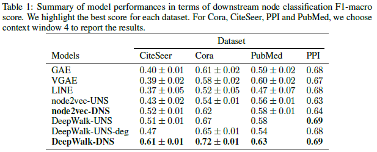

# Maximizing Cohesion and Separation in Graph Representation Learning: A Distance-aware Negative Sampling Approach

This repository is the official PyTorch implementation of [Maximizing Cohesion and Separation in Graph Representation Learning: A Distance-aware Negative Sampling Approach]()


## Requirements
All our experiments use PyTorch 1.1.0 and PyTorch geometric library. 
Follow [PyTorch geometric Installation](https://github.com/rusty1s/pytorch_geometric#installation) to install PyTorch geometric in your environment.
You need to install the following packages to run all the codes in this repository.

```setup
numpy
matplotlib
pandas
scikit-learn
scipy
networkx
seaborn
pylab
```


## Training

To train the DeepWalk-DNS model, run the DeepWalk-DNS notebook. Specify the parameters of the model in the notebook. Be careful in writing the exact data path and saved model path.
All other models are in separate notebook and require similar attention like the the DeepWalk-DNS model.

Run each notebook to train each model. 

## Evaluation

To evaluate the performance of all the models, run the F1-Evaluation notebook. Specify the parameters and the path correctly in the notebook.

Run the notebook to evaluate the models.

## Pre-trained Models

You can download pretrained models here: [All the datasets have specific folders for specific models](https://www.dropbox.com/sh/fn7mem2appso2t0/AACQbhM2dCNbTAHMh5TmhsXVa?dl=0)

Download the models and put it into the saved_models folder.

## Results
Our model achieves the following performance on:
